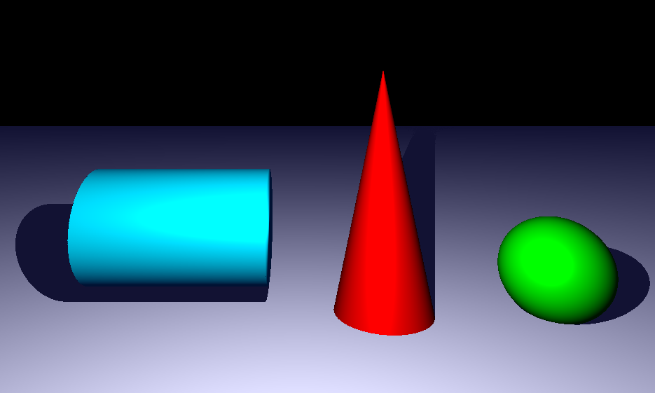

# miniRT
Thanks @Linuswidmer for the collaboration on this project!

**Raytracing** is an old - yet still very common method - for rendering algorithms that generate digital images. 

The goal of this project was to implement a ray tracing algorithm in C! (more detailed instructions can be found in the subject.pdf in the section 'Mandatory Part'). 

The following images are generated by this program:


## Learning goals
- Understand representations and transformations of 3d scenes in computer graphics.
- How to calculate the intersection(s) between vectors and objects (spheres, planes, cylinders, ...).
- How to translate the above points into code
- And of course **how to collaborate** on a project and split workload in an efficient way!

Core features of this raytracer are:
- Render spheres, planes, cylinders and cones with any orienation and position in space
- Have a variable viewpoint, view orientation as well as field of view
- Combining ambient and diffuse light sources with different colors and phong effect

# Usage
*Note that the program is written with Linux. Other operating systems were not tested.*

## Installing and Compiling
1) Clone the repository and its submodule by ``` git clone --recursive <project SSH/URL> ```
2) direct to the cloned folder ```<folder_name>```
3) ```make``` (automatically compile the libft and MiniLibX)

*Check the MiniLibX ReadMe in case of problems with the library.*

## Execution
The proram will read the input for the scene from a file in ```.rt``` format. The ```*/scenes/valid/``` folder contains some example scenes.
* Example: ```./miniRT ./scenes/valid/eval_sheet_pillars.rt```

## Scene Format
Rules for scene format
Every scene must contain at least a **Viewpoint (C)**, an **ambient lighting (A)** and one or more diffuse **light sources (L)**:
- Identifier (C) ; coordinates (x,y,z) ; orientation vector (x,y,z) [-1..1] ; field of view (deg) [1..179]
- Identifier (A) ;                       intensity ([0..1])                 ; colors (r,g,b) [0..255]
- Identifier (L) ; coordinates (x,y,z) ; intensity ([0..1])                 ; colors (r,g,b) [0..255]

Additionally the Scene can contain **Objects** such as sphere (sp), plane (pl), cylinder (cy) and cone (co)
- Identifier (sp) ; center (x,y,z) ; diameter ; color (r,g,b) [0..255]
- Identifier (pl) ; coordinates (x,y,z) ; orientation vector (x,y,z) orthogonal to plane [-1..1] ; color (r,g,b) [0..255]
- Identifier (cy) ; center (x,y,z) ; orientation vector (x,y,z) [-1..1] ; diameter ; height ; color (r,g,b) [0..255]
- Identifier (co) ; coordinates (x,y,z) of vertex) ; orientation vector (x,y,z) [-1..1] ; opening angle (deg) [1..179] ; color (r,g,b) [0..255]

Given the above rules we can define a Scene:
``` 
C   0,5,-15   0,0,1   80
A                     0.2    90,90,255
L   0,6,-10           1     255,255,255


pl  1,-1.5,10   0,1,0             255,255,255
sp  9,0.0,0.0           3.6       0,255,0
cy  -7,1.5,0    1,0,0   4     6   0,255,255
co  3,7,0       0,-1,0  23        255,0,0

```
which renders to


// not necessary maybe ?
To enable colored diffuse light sources add .. to the environment variables
``` export ... ```

# Sources
Realizing this project requires a deeper understanding of the raytracing algorithm as well as some literacy in linear algebra. The following list is a recommendation of sources for anyone who wants to know more about the topic:
| Topic								| Link                                                        	|
|----------------------------------:|:--------------------------------------------------------------|
| Linear Algebra					| [3Blue1Browns Playlist on Linear Algebra](https://www.youtube.com/watch?v=kjBOesZCoqc&list=PL0-GT3co4r2y2YErbmuJw2L5tW4Ew2O5B) |
| Raytracing technique				| [Scratchapixel](https://www.scratchapixel.com/index.html), [Computer Graphics From Scratch](https://www.gabrielgambetta.com/computer-graphics-from-scratch/)|
| Diffuse and Specular Light| [Diffuse Light](https://www.tomdalling.com/blog/modern-opengl/explaining-homogenous-coordinates-and-projective-geometry/) , [Blinn-Phong Model](https://learnopengl.com/Advanced-Lighting/Advanced-Lighting)|
|Cone |[What is a cone???](https://mathworld.wolfram.com/Cone.html), [Cone - Ray intersection](https://lousodrome.net/blog/light/2017/01/03/intersection-of-a-ray-and-a-cone/) |
|Sphere | [Sphere - Ray intersection](https://www.cl.cam.ac.uk/teaching/1718/AdvGraph/1.\ Ray\ Tracing\ -\ All\ the\ Maths.pdf) |
| | |


Old:
| Identifier | Position(x,y,z) |Orientation vector | field of view
|  --------  |  -------  | --------  |  -------  |
| C | 0.0,0.0,10 |0.0,0.0,-1|
